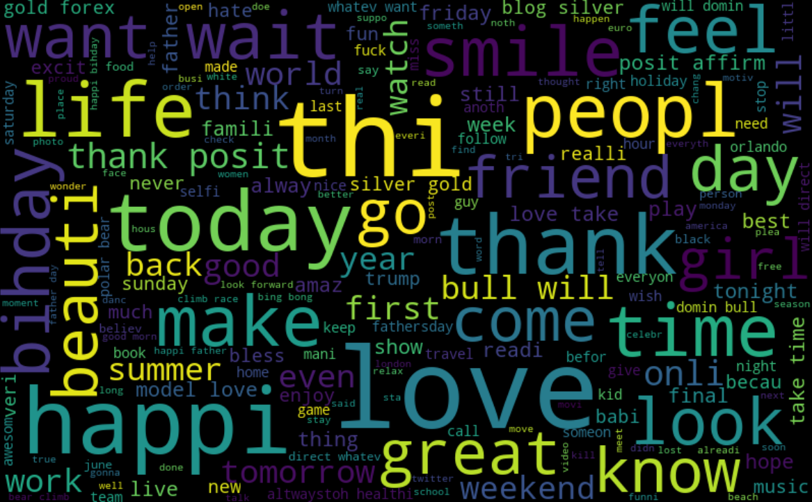
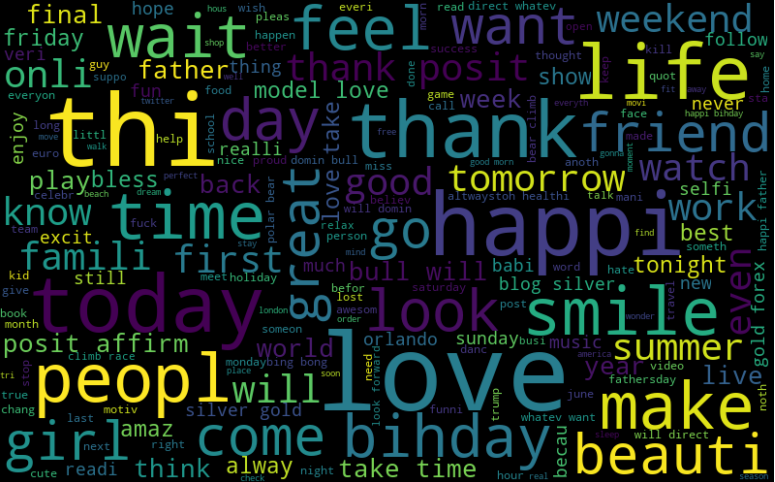
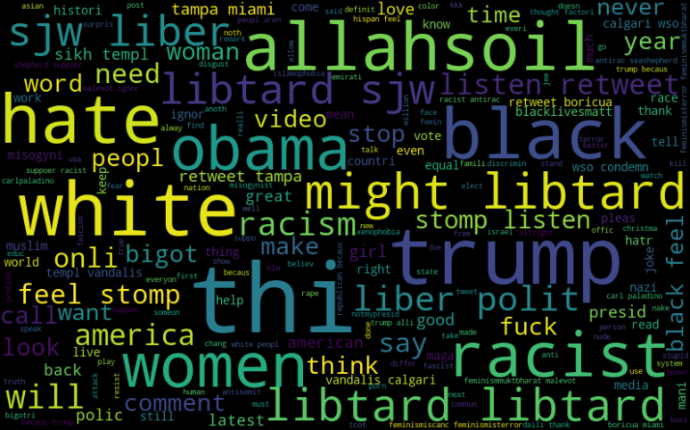
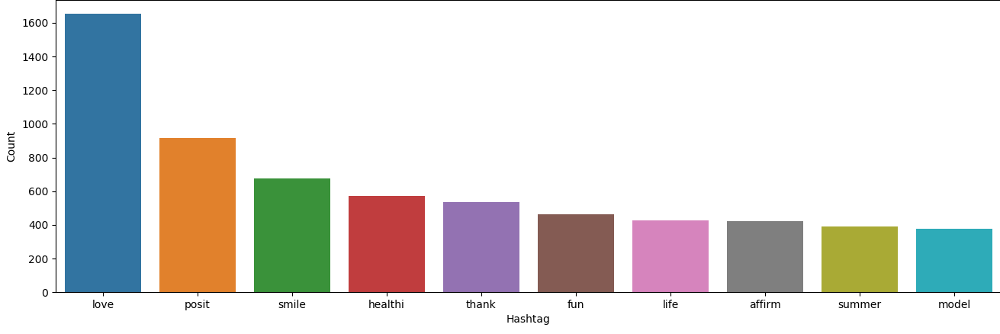
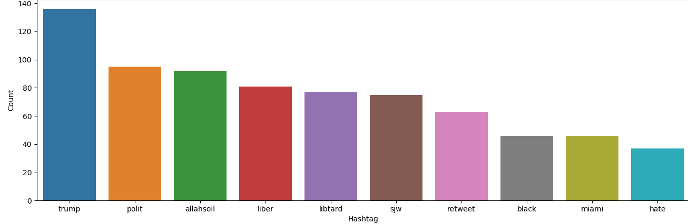

# Twitter-Sentiment-Ananlysis

Model of Tweets from Twitter.

This dataset is not made by me it has been downloaded online.

Preprocessed the data using regular expression, made WordCloud of All the words, Positive Words, Negative Words, Plotted number of tweets from neagative and positive hashtags and made a Bag of Words & TF-IDF Features model on the dataset. Then made a classifier by applying Logistic regression (Machine Learning approcah) to classify the dataset in positive and negative. 

Here are the WordCloud and Graphs. 

                                        WordCloud of all the words in the tweet

 

                                        WordCloud of all the Positive Words

                                        WordCloud of all the Neagative Words

                                        Graph of top 10 positive hashtags with most tweets
                    

                                        Graph of top 10 negative hashtags with most tweets
